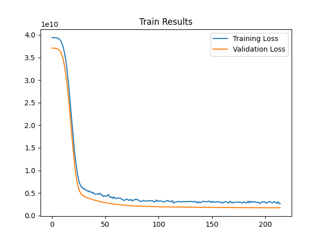

# House Prices
This project is a simple regression with a multilayer perceptron (MLP) on a weather history dataset. The MLP model consists of three layer [64, 32, 16] and optimizer of model is Adam. 
To improve the answer in this project, we have normalized the input feature. We have also used dropout and earlystopping callback to prevent overfitting.
## Results

RMSE: 44954.44